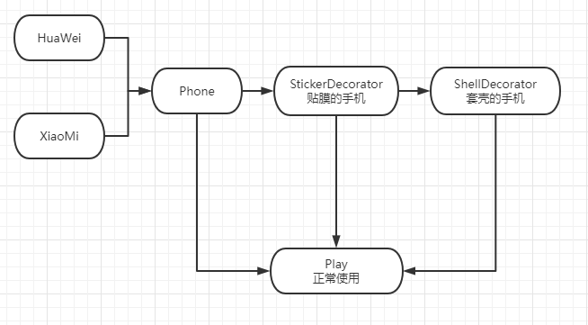

* [面向对象设计型原则](#面向对象设计型原则)
      * [单一职责原则](#单一职责原则)
      * [开闭原则](#开闭原则)
      * [里氏替换原则](#里氏替换原则)
      * [依赖倒转原则](#依赖倒转原则)
      * [接口隔离原则](#接口隔离原则)
      * [聚合复用原则](#聚合复用原则)
      * [迪米特原则](#迪米特原则)
* [面向对象创建型模式](#面向对象创建型模式)
      * [单例模式](#单例模式)
            * [饿汉模式](#饿汉模式)
            * [懒汉模式](#懒汉模式)
      * [工厂模式](#工厂模式)
            * [简单工厂模式](#简单工厂模式)
            * [工厂方法模式](#工厂方法模式)
            * [抽象工厂模式](#抽象工厂模式)
      * [原型模式](#原型模式)
      * [建造者模式](#建造者模式)
* [面向对象结构型模式](#面向对象结构型模式)
      * [适配器模式](#适配器模式)
      * [桥接模式](#桥接模式)
      * [过滤器模式](#过滤器模式)
      * [组成模式](#组成模式)
      * [装饰器模式](#装饰器模式)
      * [外观模式](#外观模式)
      * [享元模式](#享元模式)
      * [代理模式](#代理模式)
* [面向对象行为型模式](#面向对象行为型模式)
      * [责任链模式](#责任链模式)
            * [纯的模式](#纯的模式)
            * [不纯的模式](#不纯的模式)
      * [命令模式](#命令模式)
      * [解释器模式](#解释器模式)
      * [迭代器模式](#迭代器模式)
      * [中介者模式](#中介者模式)
      * [备忘录模式](#备忘录模式)
      * [观察者模式](#观察者模式)
            * [推模型](#推模型)
            * [拉模型](#拉模型)
      * [状态模式](#状态模式)
      * [策略模式](#策略模式)
      * [模板模式](#模板模式)
      * [访问者模式](#访问者模式)

# 面向对象设计型原则

### 单一职责原则

> 就一个类而言，应该仅有一个引起它变化的原因。降低变更的风险 一个类的职责越多，变更的可能性就越大，变更带来的风险也就越大
>
> 如果一个类有一个以上的职责，这些职责就耦合在了一起。一个职责的变化可能会削弱或者抑制这个类完成其他职责的能力。当一个职责发生变化时，可能会影响其它的职责。多个职责耦合在一起，会影响复用性。
>
> 单一职责原则的核心就是解耦和增强内聚性。

~~~go
func main() {
	c := Clothes{}
	fmt.Println("在工作")
	c.Onwork()
	fmt.Println("在吃饭")
	c.Oneat()
}

type Clothes struct {
}

func (c *Clothes) Onwork() {
	fmt.Println("工作时穿的衣服。。。")
}

func (c *Clothes) Oneat() {
	fmt.Println("吃饭时穿的衣服。。。")
}
/*
在工作
吃饭时穿的衣服。。。
在吃饭
吃饭时穿的衣服。。。
~~~

假设 Onwork方法中可能修改了类的一些属性，并且可能影响到 Oneat方法，这个时候就可以做改进，让一个类负责一个职责，互不冲突

~~~go
func main() {
	work := ClothesWork{}
	fmt.Println("在工作")
	work.Style()
	fmt.Println("在吃饭")
	eat := ClothesEat{}
	eat.Style()
}

type ClothesWork struct {
}
type ClothesEat struct {
}

func (c *ClothesWork) Style() {
	fmt.Println("吃饭时穿的衣服。。。")
}
func (c *ClothesEat) Style() {
	fmt.Println("吃饭时穿的衣服。。。")
}
/*
在工作
吃饭时穿的衣服。。。
在吃饭
吃饭时穿的衣服。。。
~~~

### 开闭原则

> 需求总是变化的， 如何才能做到不对原有系统修改的前提下，实现灵活的扩展，多扩展少修改原则。
>
> 核心就是面对抽象编程，抽象相对稳定。 让类依赖于固定的抽象，所以对修改是封闭的；而通过面向对象的继承和多态机制，可以实现对抽象体的继承，通过重写其方法来改变固有行为，实现新的扩展方法。

~~~go
func main() {
	b := Bank{}
	b.Pay()
	b.Transfer()
	b.Save()
    b.Stock()
}

type Bank struct {
}

func (receiver Bank) Pay() {
	fmt.Println("支付中。。。。")
}
func (receiver Bank) Transfer() {
	fmt.Println("转账中。。。。")
}
func (receiver Bank) Save() {
	fmt.Println("存款中。。。。")
}
// 新增业务扩展
func (receiver Bank) Stock() {
	fmt.Println("股票。。。。")
}
/*
支付中。。。。
转账中。。。。
存款中。。。。
股票。。。。
~~~

这里可能体现不出来修改了 Bank这个类，这是因为GO语言的特性，但是我们确实是扩展了 Bank这个类，假设类比较庞大，那这种方式可能会增大耦合，不知道其他的方法对这个类做了什么修改，下面用接口继承的方式来修改，每次扩展新的类只需要继承接口重写方法

~~~go
func main() {
	BankerWork(&Save{})
	BankerWork(&Pay{})
	BankerWork(&Transfer{})
	BankerWork(&Stock{})
}

type Banker interface {
	Work()
}
func BankerWork(banker Banker) {
	banker.Work()
}

type Save struct {
}
func (receiver Save) Work() {
	fmt.Println("存款中。。。。")
}

type Pay struct {
}
func (receiver Pay) Work() {
	fmt.Println("支付中。。。。")
}

type Transfer struct {
}
func (receiver Transfer) Work() {
	fmt.Println("转账中。。。。")
}

type Stock struct {
}
func (receiver Stock) Work() {
	fmt.Println("股票。。。。")
}
/*
存款中。。。。
支付中。。。。
转账中。。。。
股票。。。。
~~~

### 里氏替换原则

> 所谓替换，我的理解就是子类需要继承实现父类的所有抽象方法，当然子类也可以有自己的个性方法，也就是说必要时子类可以是父类的替身，子类当做父类使用扩展。

~~~go
func main() {
	worker1 := father{}
	worker1.work()
	worker2 := child{}
	worker2.work()
	worker2.play()
}

type Work interface {
	work()
}

type father struct {
	Work
}
type child struct {
	father
}

func (receiver father) work() {
	fmt.Println("父类的work方法。。。")
}

func (receiver child) work() {
	fmt.Println("子类的work方法。。。")
}
func (receiver child) play() {
	fmt.Println("子类的play方法。。。")
}
/*
父类的work方法。。。
子类的work方法。。。
子类的play方法。。。
~~~

### 依赖倒转原则

> 与里氏替换原则不同的是，依赖于抽象接口而不是具体的实现类。
>
> 里氏替换是子类和父类，依赖倒转是抽象和细节，面对的不是相对多变的子类，而是相对稳定的接口。

~~~go
func main() {
	宝马 := 宝马{}
	奔驰 := 奔驰{}
	张三 := 张三{}
	李四 := 李四{}
	张三.Drive_1(宝马)
	李四.Drive_2(奔驰)
}

type 宝马 struct {
}
func (receiver 宝马) Run() {
	fmt.Println("宝马启动了。。。")
}

type 奔驰 struct {
}
func (receiver 奔驰) Run() {
	fmt.Println("奔驰启动了。。。")
}

type 张三 struct {
}
func (receiver 张三) Drive_1(car 宝马) {
	fmt.Println("司机张三：")
	car.Run()
}
func (receiver 张三) Drive_2(car 奔驰) {
	fmt.Println("司机张三：")
	car.Run()
}

type 李四 struct {
}
func (receiver 李四) Drive_1(car 宝马) {
	fmt.Println("司机李四：")
	car.Run()
}
func (receiver 李四) Drive_2(car 奔驰) {
	fmt.Println("司机李四：")
	car.Run()
}
/*
司机张三：
宝马启动了。。。
司机李四：
奔驰启动了。。。
~~~

这个例子就可以看出如果我们要扩展司机或者是扩展车辆都很麻烦，需要修改每个类，下面抽象成接口，司机只需要完成司机的功能，汽车也只需要完成汽车功能，不在乎是谁和是谁来完成。

~~~go
func main() {
	宝马 := 宝马{}
	奔驰 := 奔驰{}
	本田 := 本田{}
	张三 := 张三{}
	李四 := 李四{}
	张三.Drive(宝马)
	李四.Drive(奔驰)
	张三.Drive(本田)
}

type Car interface {
	Run()
}
type Driver interface {
	Drive()
}

type 宝马 struct {
}
func (receiver 宝马) Run() {
	fmt.Println("宝马启动了。。。")
}

type 奔驰 struct {
}
func (receiver 奔驰) Run() {
	fmt.Println("奔驰启动了。。。")
}

type 本田 struct {
}
func (receiver 本田) Run() {
	fmt.Println("本田启动了。。。")
}

type 张三 struct {
}
func (receiver 张三) Drive(car Car) {
	fmt.Println("司机张三：")
	car.Run()
}

type 李四 struct {
}
func (receiver 李四) Drive(car Car) {
	fmt.Println("司机李四：")
	car.Run()
}
/*
司机张三：
宝马启动了。。。
司机李四：
奔驰启动了。。。
司机张三：
本田启动了。。。
~~~

### 接口隔离原则

> 从约束上看，单一职责原则注重对接口职责的划分，接口隔离原则更注重的是对接口依赖程度的隔离，换句话说就是不强迫用户的程序依赖他们不需要的接口方法，不应该把所有的操作都封装到一个接口中，使用多个专门的接口能够体现对象的层次，通过接口的继承实现总接口的定义。
>
> 接口尽量细化，需要什么接口提供什么接口，不必要的方法剔除到另一个接口中。

~~~go
func main() {
	student := Student{}
	teacher := Teacher{}
	student.view_score()
	teacher.view_score()
	teacher.delete_score()
	teacher.save_score()
	teacher.update_score()
}

type View_score interface {
	view_score()
}
type Edit_score interface {
	save_score()
	update_score()
	delete_score()
}
type Score interface {
	View_score
	Edit_score
}

type Student struct {
	View_score
}
type Teacher struct {
	Score
}

func (receiver Student) view_score() {
	fmt.Println("学生查看成绩。。。")
}

func (receiver Teacher) view_score() {
	fmt.Println("老师查看成绩。。。")
}
func (receiver Teacher) save_score() {
	fmt.Println("老师保存成绩。。。")
}
func (receiver Teacher) update_score() {
	fmt.Println("老师更新成绩。。。")
}
func (receiver Teacher) delete_score() {
	fmt.Println("老师删除成绩。。。")
}
/*
学生查看成绩。。。
老师查看成绩。。。
老师删除成绩。。。
老师保存成绩。。。
老师更新成绩。。。
~~~

这个例子就可以很好表示接口隔离了，学生只有查看成绩的权限，而老师具有所有的权限，假设这里如果是让学生继承 Score接口而不是拆分出View_score，后面还需要对学生不需要的特权方法重写，增大了耦合，同时以后扩展起来也还要都修改。

### 聚合复用原则

> 这种原则要求我们尽量优先使用组合的关联方式来实现，其次才考虑继承关系，因为如果使用继承，父类的任何修改都可能影响到子类的行为。如果使用继承应该严格遵守里氏替换原则。

~~~go
func main() {
	cat := BlackCat{}
	cat.eat()
	cat.slepp()
	cat.play()
}

type Cat struct {
    age  int
    name string
}
type BlackCat struct {
	Cat
}

func (receiver Cat) eat() {
	fmt.Println("小猫吃。。。")
}
func (receiver Cat) slepp() {
	fmt.Println("小猫睡觉。。。")
}
func (receiver BlackCat) play() {
	fmt.Println("黑猫玩耍。。。")
}
/*
小猫吃。。。
小猫睡觉。。。
黑猫玩耍。。。
~~~

这种就是继承的方式，父类的属性都被子类继承下来了，子类和父类的依赖耦合太高，可以用组合的方式复用。

~~~go
func main() {
	cat := Cat{}
	blackcat := BlackCat{}
	blackcat.eat(cat)
	blackcat.sleep(cat)
	blackcat.play()
}

type Cat struct {
    age  int
    name string
}
type BlackCat struct {
}

func (receiver Cat) eat() {
	fmt.Println("小猫吃。。。")
}
func (receiver Cat) slepp() {
	fmt.Println("小猫睡觉。。。")
}

func (receiver BlackCat) eat(cat Cat) {
	cat.eat()
}
func (receiver BlackCat) sleep(cat Cat) {
	cat.slepp()
}
func (receiver BlackCat) play() {
	fmt.Println("黑猫玩耍。。。")
}
/*
小猫吃。。。
小猫睡觉。。。
黑猫玩耍。。。
~~~

这个例子中就是通过让 Cat作为参数传进来组合，和 Cat有依赖关系的仅仅是传参进来的方法，降低了与父类之间的耦合。

也可以把父类当做一个属性组合在一起，尽量不动父类。

~~~go
func main() {
	blackcat := BlackCat{}
	blackcat.cat.eat()
	blackcat.cat.slepp()
	blackcat.play()
}

type Cat struct {
	age  int
	name string
}
type BlackCat struct {
	cat Cat
}

func (receiver Cat) eat() {
	fmt.Println("小猫吃。。。")
}
func (receiver Cat) slepp() {
	fmt.Println("小猫睡觉。。。")
}
func (receiver BlackCat) play() {
	fmt.Println("黑猫玩耍。。。")
}
/*
小猫吃。。。
小猫睡觉。。。
黑猫玩耍。。。
~~~

### 迪米特原则

> 最小知识法则，类和类之间最少依赖，有选择的暴露方法，类的依赖关系尽量简单独立，也就是说一个对象对其他对象应该保持尽可能的少的了解，降低之间耦合，提高可维护性
>
> 比如说买房子，在客户和房源之间添加个中介，客户不需要每个房源都去了解和每个房源之间做比较，同时客户也不是一个两个，可能是很多很多的对象，这个时候就需要添加中介帮助客户提前全部都了解，客户可直接通过中介就可以了解所有房源。
>
> 各个模块之间相互调用通过提供一个统一的接口实现，这样模块之间就不需要了解其内部细节，内部发生改变不影响其他模块调用。
>
> 但是这样的后果就是系统中存在大量的中介类，这些类之所以存在完全是为了传递类之间的相互调用关系，这在一定程度上增加了系统的复杂度。

~~~go
func main() {
	客户1 := 客户{name: "张三"}
	客户2 := 客户{name: "李四"}
	房东 := 房东{name: "王五"}
	中介 := 中介{房源: 房东}
	客户1.find_home(中介)
	客户2.find_home(中介)
}

type Find_home interface {
	find_home()
}
type Sale_home interface {
	sale_home()
}

type 房东 struct {
	name string
}
type 客户 struct {
	name string
}
type 中介 struct {
	房源 房东
}

func (receiver 房东) sale_home() {
	fmt.Println(" -房东卖房子。。。")
}
func (receiver 客户) find_home(m 中介) {
	fmt.Println(receiver.name, "-客户找房子。。。")
	m.match_home()
}
func (receiver 中介) match_home() {
	fmt.Print(receiver.房源.name)
	receiver.房源.sale_home()
	fmt.Println("匹配成功。。。")
}
/*
张三 -客户找房子。。。
王五 -房东卖房子。。。
匹配成功。。。
李四 -客户找房子。。。
王五 -房东卖房子。。。
匹配成功。。。
~~~

像这样，客户不需要了解所有的房源，不需要管房东是谁，房东不需要管客户是谁，客户要买房子直接找中介就可以，如果有房子就进行下一步操作，减少了客户与所有房源之间的依赖，降低耦合但可能会增大复杂度。

# 面向对象创建型模式

### 单例模式

> 保证一个类仅有一个实例，并提供一个访问它的全局访问点，主要解决一个全局使用的类频繁的创建和销毁，节省内存的开销，避免对资源的多重占用。没有接口，不能继承，与单一职责原则冲突，一个类应该只关心内部逻辑，而不关心外部怎么实例化的。关键代码构造函数私有化，外部不能随意创建，但是Go语言没这种，private、public。那就用大小写来代替是否对外暴露
>
> 大家都要喝水，但是没必要每人家里都打一口井，通常的做法是整个村里打一个井就够了，大家都从这个井里面打水喝。
>
> - 1、单例类只能有一个实例。
> - 2、单例类必须自己创建自己的唯一实例。
> - 3、单例类必须给所有其他对象提供这一实例。

##### 饿汉模式

> 提前实例化好对象，等待直接调用就行。
>
> 优点：写法简单，在类装载时完成实例化，没有加锁，执行效率会提高，避免了线程同步问题。
>
> 缺点：类装载时完成实例化，没有达到懒加载的效果，若该实例从未使用，则会造成内存浪费。

~~~go
func main() {
	sing1 := GetInstance()
	sing1.SingFunc()
    
    sing2 := GetInstance()
	fmt.Printf("sing1:%p\tsing2:%p", sing1, sing2)
}
// 小写代表private，对外暴露GetInstance获取实例
var instance *singleton = new(singleton)

type singleton struct {
}

func GetInstance() *singleton {
	return instance
}
func (receiver singleton) SingFunc() {
	fmt.Println("饿汉式的方法。。。")
}
/*
饿汉式的方法。。。
sing1:0x660458	sing2:0x660458
~~~

##### 懒汉模式

> 饿汉式可能造成资源浪费，所以就有了懒汉式，先不创建类的对象实例，等需要的时候再创建。
>
> 线程不安全：懒加载，没有加锁，所以线程不安全，多线程下不能正常工作。
>
> 线程安全：懒加载，能够在多线程中工作，但是加锁效率降低

~~~go
func main() {
	sing1 := GetInstance()
	sing1.SingFunc()

	sing2 := GetInstance()
	fmt.Printf("sing1:%p\tsing2:%p", sing1, sing2)
}
// 小写代表private，对外暴露GetInstance获取实例
var instance *singleton

type singleton struct {
}

func GetInstance() *singleton {
	if instance == nil {
		instance = new(singleton)
	}
	return instance
}
func (receiver singleton) SingFunc() {
	fmt.Println("懒汉式的线程不安全方法。。。")
}
/*
懒汉式的线程不安全方法。。。
sing1:0xa80438	sing2:0xa80438
~~~

~~~go
func main() {
	sing1 := GetInstance()
	sing1.SingFunc()

	sing2 := GetInstance()
	fmt.Printf("sing1:%p\tsing2:%p", sing1, sing2)
}
// 小写代表private，对外暴露GetInstance获取实例
var instance *singleton
var lock sync.Mutex
var initialized uint32

type singleton struct {
}

func GetInstance() *singleton {
	// 标记位
	if atomic.LoadUint32(&initialized) == 1 {
		return instance
	}

	lock.Lock()
	defer lock.Unlock()
	if instance == nil {
		instance = new(singleton)
		atomic.StoreUint32(&initialized, 1)
	}
	return instance
}
func (receiver singleton) SingFunc() {
	fmt.Println("懒汉式的线程安全方法。。。")
}
/*
懒汉式的线程安全方法。。。
sing1:0xc50460	sing2:0xc50460

添加标记位的目的就是减少加锁的次数，多线程时每次调用这个方法都要加锁判断效率会很低。
~~~

> Go语言还有一种新的方法，就是 once，内容只执行一次，这样就简化了加锁实例

~~~go
func main() {
	sing1 := GetInstance()
	sing1.SingFunc()

	sing2 := GetInstance()
	fmt.Printf("sing1:%p\tsing2:%p", sing1, sing2)
}
// 小写代表private，对外暴露GetInstance获取实例
var instance *singleton
var once sync.Once

type singleton struct {
}

func GetInstance() *singleton {
	once.Do(func() {
		instance = new(singleton)
	})
	return instance
}
func (receiver singleton) SingFunc() {
	fmt.Println("懒汉式的线程安全方法。。。")
}
/*
懒汉式的线程安全方法。。。
sing1:0xc70458	sing2:0xc70458
~~~

### 工厂模式

##### 简单工厂模式

~~~go
func main() {
	fruitfactory := FruitFactory{}
	apple := fruitfactory.CreatFruit("apple")
	apple.show()
	pear := fruitfactory.CreatFruit("pear")
	pear.show()
}

type FruitFactory struct {
}
type apple struct {
}
type pear struct {
}
type Fruit interface {
	show()
}

func (receiver apple) show() {
	fmt.Println("苹果。。。")
}
func (receiver pear) show() {
	fmt.Println("梨子。。。")
}
func (receiver FruitFactory) CreatFruit(fruit string) Fruit {
	switch fruit {
	case "apple":
		return apple{}
	case "pear":
		return pear{}
	}
	return nil
}
/*
苹果。。。
梨子。。。
~~~

##### 工厂方法模式

~~~go
func main() {
	applefactory := new(appleFactory)
	apple := applefactory.CreatFruit()
	apple.Show()

	var pearfactory FruitFactory
	pearfactory = new(pearFactory)
	pear := pearfactory.CreatFruit()
	pear.Show()
}

type FruitFactory interface {
	CreatFruit() Fruit
}
type Fruit interface {
	Show()
}
type appleFactory struct {
}
type pearFactory struct {
}

type apple struct {
}
func (receiver apple) Show() {
	fmt.Println("苹果。。。。")
}

type pear struct {
}
func (receiver pear) Show() {
	fmt.Println("梨子。。。。")
}

func (receiver appleFactory) CreatFruit() Fruit {
	return apple{}
}
func (receiver pearFactory) CreatFruit() Fruit {
	return pear{}
}
/*
苹果。。。。
梨子。。。。
~~~

##### 抽象工厂模式

~~~go
func main() {
	var chinaFactory Factory
	chinaFactory = new(ChinaFactory)
	chinaApple := chinaFactory.CreatApple()
	chinaApple.show()

	usaFactory := USAFactory{}
	usaPear := usaFactory.CreatPear()
	usaPear.show()
}

// 抽象层
type Factory interface {
	CreatApple() Apple
	CreatPear() Pear
}
type Apple interface {
	show()
}
type Pear interface {
	show()
}

// 中国工厂
type ChinaFactory struct {
}
type ChinaApple struct {
}
type ChinaPear struct {
}

func (receiver ChinaFactory) CreatApple() Apple {
	return ChinaApple{}
}
func (receiver ChinaFactory) CreatPear() Pear {
	return ChinaPear{}
}
func (receiver ChinaApple) show() {
	fmt.Println("中国的苹果。。。")
}
func (receiver ChinaPear) show() {
	fmt.Println("中国的梨子。。。")
}

// 美国工厂
type USAFactory struct {
}
type USAApple struct {
}
type USAPear struct {
}

func (receiver USAFactory) CreatApple() Apple {
	return USAApple{}
}
func (receiver USAFactory) CreatPear() Pear {
	return USAPear{}
}
func (receiver USAApple) show() {
	fmt.Println("美国的苹果。。。")
}
func (receiver USAPear) show() {
	fmt.Println("美国的梨子。。。")
}
/*
中国的苹果。。。
美国的梨子。。。
~~~

### 原型模式

> 用于创建重复的对象，同时又能保证性能，当直接创建对象的代价比较大时，则采用这种模式。一个对象需要在一个高代价的数据库操作之后被创建。我们可以缓存该对象，在下一个请求时返回它的克隆，在需要的时候更新数据库，以此来减少数据库调用。
>
> 浅拷贝、深拷贝

~~~go
func main() {
	Manager = NewCellsManager()
	细胞1 := &Cell{
		ID: 1,
	}
	fmt.Printf("细胞1：%p\n", 细胞1)

	Manager.Set("标号1", 细胞1)
	fmt.Printf("缓存中的细胞1：%p\n", Manager.Get("标号1"))

	细胞2 := Manager.Get("标号1").Clone()
	fmt.Printf("细胞2：%p\n", 细胞2)
}

var Manager *CellsManager

type CloneCache interface {
	Clone() CloneCache
}
type Cell struct {
	ID uint32
}
func (receiver *Cell) Clone() CloneCache {
	cloneCell := *receiver
	return &cloneCell
}

type CellsManager struct {
	cloneCache map[string]CloneCache
}
func NewCellsManager() *CellsManager {
	return &CellsManager{
		cloneCache: make(map[string]CloneCache),
	}
}
func (receiver *CellsManager) Set(name string, cloneCache CloneCache) {
	receiver.cloneCache[name] = cloneCache
}
func (receiver *CellsManager) Get(name string) CloneCache {
	return receiver.cloneCache[name]
}
/*
细胞1：0xc00000a098
缓存中的细胞1：0xc00000a098
细胞2：0xc00000a0cc

细胞2和细胞1的地址不同，也说明是从Cache中拷贝出来的新对象
~~~

### 建造者模式

> 使用多个简单的对象一步一步构建成一个复杂的对象，一个 Builder 类一步一步构造最终的对象，该 Builder 类是独立于其他对象的。
>
> 面临着一个复杂对象的创建工作，其通常由各个部分的子对象用一定的算法构成；由于需求的变化，这个复杂对象的各个部分经常面临着剧烈的变化，但是将它们组合在一起的算法却相对稳定。
>
> 建造者：创建和提供实例，导演：管理建造出来的实例的依赖关系。将变与不变的分离开。

~~~go
func main() {
	mealBuilder = NewMealBuilder()
	张三 := Meal{
		Items: make(map[string]Item),
		sum:   0,
	}
	张三.AddItem("蔬菜汉堡", mealBuilder.BurgerMeal.vegBurger)
	张三.AddItem("可乐", mealBuilder.DrinkMeal.cock)
	张三.AddItem("鸡肉汉堡", mealBuilder.BurgerMeal.chickenBurger)
	张三.AddItem("果汁", mealBuilder.DrinkMeal.juice)
	张三.ShowItems()
	张三.GetSum()
	fmt.Println("一共花费：", 张三.sum, "元")
}

var mealBuilder *MealBuilder

type Item interface {
	GetPrice() float64
}
type VegBurger struct {
}
type ChickenBurger struct {
}
type Coke struct {
}
type Juice struct {
}

func (receiver VegBurger) GetPrice() float64 {
	return 8.0
}
func (receiver ChickenBurger) GetPrice() float64 {
	return 10.0
}
func (receiver Coke) GetPrice() float64 {
	return 5.8
}
func (receiver Juice) GetPrice() float64 {
	return 4.3
}

type Burger struct {
	vegBurger     VegBurger
	chickenBurger ChickenBurger
}
type Drink struct {
	cock  Coke
	juice Juice
}

type Meal struct {
	Items map[string]Item
	sum   float64
}

func (receiver *Meal) AddItem(name string, item Item) {
	receiver.Items[name] = item
}
func (receiver *Meal) GetSum() {
	receiver.sum = 0
	for _, item := range receiver.Items {
		receiver.sum += item.GetPrice()
	}
}
func (receiver *Meal) ShowItems() {
	fmt.Println("--- 账单 ---")
	for name, item := range receiver.Items {
		fmt.Println(name, ":", item.GetPrice(), "元")
	}
	fmt.Println("------------")
}

type MealBuilder struct {
	BurgerMeal *Burger
	DrinkMeal  *Drink
}
func NewMealBuilder() *MealBuilder {
	return &MealBuilder{
		BurgerMeal: new(Burger),
		DrinkMeal:  new(Drink),
	}
}
/*
--- 账单 ---
果汁 : 4.3 元
蔬菜汉堡 : 8 元
可乐 : 5.8 元
鸡肉汉堡 : 10 元
------------
一共花费： 28.1 元
~~~

# 面向对象结构型模式

### 适配器模式

> 作为两个不兼容的接口之间的桥梁，将一个类的接口转换成客户希望的另外一个接口。适配器模式使得原本由于接口不兼容而不能一起工作的那些类可以一起工作。
>
> 比如：读卡器是作为内存卡和笔记本之间的适配器。您将内存卡插入读卡器，再将读卡器插入笔记本，这样就可以通过笔记本来读取内存卡。
>
> 适配器继承或依赖已有的对象，实现想要的目标接口。

~~~go
func main() {
	player := AudioPlayer{}
	player.play("mp3", "test1.mp3")
	player.play("mp4", "test2.mp4")
	player.play("wav", "test3.wav")
	player.play("txt", "test4.txt")
	player.play("png", "test5.png")
}

var mediaAdapter MediaAdapter

type Player interface {
	play(audioType string, fileName string)
}
type AdvPlayer interface {
	playMp4(fileName string)
	playWAV(fileName string)
}

type Mp4Player struct {
}
type WAVPlayer struct {
}

func (receiver Mp4Player) playMp4(fileName string) {
	fmt.Println("Mp4Player playing ... :", fileName)
}
func (receiver Mp4Player) playWAV(fileName string) {
}
func (receiver WAVPlayer) playMp4(fileName string) {
}
func (receiver WAVPlayer) playWAV(fileName string) {
	fmt.Println("WAVPlayer playing ... :", fileName)
}

type MediaAdapter struct {
	mp4 Mp4Player
	wav WAVPlayer
}

func (receiver MediaAdapter) play(audioType string, fileName string) {
	switch audioType {
	case "mp4":
		receiver.mp4.playMp4(fileName)
	case "wav":
		receiver.wav.playWAV(fileName)
	}
}

type AudioPlayer struct {
}

func (receiver AudioPlayer) play(audioType string, fileName string) {
	if audioType == "mp3" {
		fmt.Println("Mp3Player playing ... :", fileName)
	} else if audioType == "mp4" || audioType == "wav" {
		mediaAdapter.play(audioType, fileName)
	} else {
		fmt.Println("不支持这种格式：", audioType)
	}
}
/*
Mp3Player playing ... : test1.mp3
Mp4Player playing ... : test2.mp4
WAVPlayer playing ... : test3.wav
不支持这种格式： txt
不支持这种格式： png

假设 AudioPlayer 只能够播放 MP3，要播放 MP4、WAV可以通过扩展适配器去完成这些工作。
~~~

### 桥接模式

> 将抽象部分与实现部分分离，使它们都可以独立的变化
>
> 优点：1、抽象和实现的分离。 2、优秀的扩展能力。 3、实现细节对客户透明。
>
> 缺点：桥接模式的引入会增加系统的理解与设计难度，由于聚合关联关系建立在抽象层，要求针对抽象进行设计与编程。
>
> 假设有两台电脑，Mac和Windows。 还有两台打印机， 爱普生和惠普。 这两台电脑和打印机可能会任意组合使用。 客户端不应去担心如何将打印机连接至计算机的细节问题，创建两个层次结构，而不是2*2组合的结构。
>
> 看的见得计算机是抽象的，实施的打印机是具体的，两个层次通过桥接沟通，计算机包含对打印机的引用，抽象层和实施层可独立开发互不影响。

~~~go
func main() {
	hp := Hp{}
	epson := Epson{}
	mac := Mac{}
	win := Win{}

	mac.SetReqPrinter(hp)
	mac.ReqPrint()
	win.SetReqPrinter(epson)
	win.ReqPrint()
}

type Computer interface {
	ReqPrint()
	SetReqPrinter(ReqPrinter)
}
type Mac struct {
	ReqPrinter ReqPrinter
}
type Win struct {
	ReqPrinter ReqPrinter
}
type ReqPrinter interface {
	ReqPrintFile()
}
type Hp struct {
}
type Epson struct {
}

func (receiver Epson) ReqPrintFile() {
	fmt.Println("爱普生 接受打印请求")
}
func (receiver Hp) ReqPrintFile() {
	fmt.Println("惠普 接受打印请求")
}

func (receiver *Mac) ReqPrint() {
	fmt.Println("Mac 请求打印机。。。")
	receiver.ReqPrinter.ReqPrintFile()
}
func (receiver *Mac) SetReqPrinter(ReqPrinter ReqPrinter) {
	receiver.ReqPrinter = ReqPrinter
}
func (receiver *Win) ReqPrint() {
	fmt.Println("Win 请求打印机。。。")
	receiver.ReqPrinter.ReqPrintFile()
}
func (receiver *Win) SetReqPrinter(ReqPrinter ReqPrinter) {
	receiver.ReqPrinter = ReqPrinter
}
/*
Mac 请求打印机。。。
惠普 接受打印请求
Win 请求打印机。。。
爱普生 接受打印请求
~~~

### 过滤器模式

> 允许使用不同的标准来过滤一组对象，通过逻辑运算以解耦的方式把它们连接起来，它结合多个标准来获得单一标准。

~~~go
func main() {
	maleFilter = NewMaleFilter()
	femaleFilter = NewFemaleFilter()
	adultFilter = NewAdultFilter()

	var people []Person
	people = append(people, Person{name: "张三", sex: "男", age: 20})
	people = append(people, Person{name: "王五", sex: "男", age: 8})
	people = append(people, Person{name: "李四", sex: "女", age: 30})
	people = append(people, Person{name: "赵六", sex: "女", age: 13})

	male := maleFilter.Filter(people)
	female := femaleFilter.Filter(people)
	adult := adultFilter.Filter(people)

	fmt.Printf("原始：%v\n", people)
	fmt.Printf("男性：%v\n", male)
	fmt.Printf("女性：%v\n", female)
	fmt.Printf("成年：%v\n", adult)

}

var maleFilter *MaleFilter
var femaleFilter *FemaleFilter
var adultFilter *AdultFilter

type Person struct {
	name string
	sex  string
	age  uint32
}

type Filter interface {
	Filter([]Person) []Person
}

type MaleFilter struct {
}
type FemaleFilter struct {
}
type AdultFilter struct {
}

func (receiver MaleFilter) Filter(people []Person) []Person {
	var tmp []Person
	for _, item := range people {
		if item.sex == "男" {
			tmp = append(tmp, item)
		}
	}
	return tmp
}
func (receiver FemaleFilter) Filter(people []Person) []Person {
	var tmp []Person
	for _, item := range people {
		if item.sex == "女" {
			tmp = append(tmp, item)
		}
	}
	return tmp
}
func (receiver AdultFilter) Filter(people []Person) []Person {
	var tmp []Person
	for _, item := range people {
		if item.age >= 18 {
			tmp = append(tmp, item)
		}
	}
	return tmp
}
func NewMaleFilter() *MaleFilter {
	return new(MaleFilter)
}
func NewFemaleFilter() *FemaleFilter {
	return new(FemaleFilter)
}
func NewAdultFilter() *AdultFilter {
	return new(AdultFilter)
}
/*
原始：[{张三 男 20} {王五 男 8} {李四 女 30} {赵六 女 13}]
男性：[{张三 男 20} {王五 男 8}]
女性：[{李四 女 30} {赵六 女 13}]
成年：[{张三 男 20} {李四 女 30}]
~~~

### 组成模式

> 将对象组合成树形结构以表示"部分-整体"的层次结构。组合模式使得用户对单个对象和组合对象的使用具有一致性，模糊了简单和复杂的概念，客户程序可以像处理简单元素一样来处理复杂元素，内部结构解耦。
>
> 优点： 1、高层模块调用简单。 2、节点自由增加。
>
> 缺点：在使用组合模式时，其叶子和树枝的声明都是实现类，而不是接口，违反了依赖倒置原则。
>
> 树枝和树叶和树干的关系，部分-整体层次结构

~~~go
func main() {
	id_1 := NewEmployee("张三", "董事长")
	id_2 := NewEmployee("李四", "经理")
	id_3 := NewEmployee("王五", "保安队长")
	id_4 := NewEmployee("赵六", "后勤部长")
	id_5 := NewEmployee("小明", "保安")
	id_6 := NewEmployee("小红", "服务员")

	id_1.add(id_2) // 董事长管经理就行
	id_2.add(id_3) // 经理管保安队长和后勤部长就行
	id_2.add(id_4)
	id_3.add(id_5) // 保安队长管保安就行
	id_4.add(id_6) // 后勤部长管服务员就行

	for _, item1 := range id_1.getLowerStaff() {
		fmt.Println(id_1.department, "的下级员工：", item1.department)
		for _, item2 := range item1.getLowerStaff() {
			fmt.Println(item1.department, "的下级员工：", item2.department)
			for _, item3 := range item2.getLowerStaff() {
				fmt.Println(item2.department, "的下级员工：", item3.department)
			}
		}
	}
}

type Employee struct {
	name       string
	department string
	lowerStaff []*Employee
}

func (receiver *Employee) add(employee *Employee) {
	receiver.lowerStaff = append(receiver.lowerStaff, employee)
}
func (receiver *Employee) getLowerStaff() []*Employee {
	return receiver.lowerStaff
}
func NewEmployee(name string, department string) *Employee {
	return &Employee{
		name:       name,
		department: department,
		lowerStaff: nil,
	}
}
/*
董事长 的下级员工： 经理
经理 的下级员工： 保安队长
保安队长 的下级员工： 保安
经理 的下级员工： 后勤部长
后勤部长 的下级员工： 服务员
~~~

### 装饰器模式

> 允许向一个现有的对象添加新的功能，同时又不改变其结构，装饰器模式相比生成子类更为灵活。
>
> 优点：装饰类和被装饰类可以独立发展，不会相互耦合，装饰模式是继承的一个替代模式，装饰模式可以动态扩展一个实现类的功能。
>
> 缺点：多层装饰比较复杂。
>
> 一幅画有没有画框都可以挂在墙上，但是通常都是有画框的，并且实际上是画框被挂在墙上。在挂在墙上之前，画可以被蒙上玻璃装到框里；这时画、玻璃和画框形成了一个物体。

~~~go
func main() {
	stickerDecorator := NewStickerDecorator(XiaoMi{})
	stickerDecorator.Sticker()
	stickerDecorator.Play()
	fmt.Println("----------------------")
	shellDecorator := NewShellDecorator(HuaWei{})
	shellDecorator.SetShell()
	shellDecorator.Play()
	fmt.Println("----------------------")
	decorator := NewShellDecorator(NewStickerDecorator(XiaoMi{}))
	decorator.Play()
}

type Sticker interface { // 贴膜
	Sticker()
}
type SetShell interface { // 套壳
	SetShell()
}
type Phone interface { // 手机
	Play()
}
type HuaWei struct {
}
type XiaoMi struct {
}
type StickerDecorator struct {	// 装饰器
}
type ShellDecorator struct {
}

func (receiver HuaWei) Play() {
	fmt.Println("使用的是华为手机。。。")
}
func (receiver XiaoMi) Play() {
	fmt.Println("使用的是小米手机。。。")
}
func (receiver *ShellDecorator) SetShell() {
	fmt.Println("正在套壳")
}
func (receiver *StickerDecorator) Sticker() {
	fmt.Println("正在贴膜")
}
func (receiver *ShellDecorator) Play() {
	fmt.Println("使用的是套壳了的手机")
}
func (receiver *StickerDecorator) Play() {
	fmt.Println("使用的是贴膜了的手机")
}
func NewStickerDecorator(phone Phone) *StickerDecorator {
	phone.Play()
	return new(StickerDecorator)
}
func NewShellDecorator(phone Phone) *ShellDecorator {
	phone.Play()
	return new(ShellDecorator)
}
/*
使用的是小米手机。。。
正在贴膜
使用的是贴膜了的手机
----------------------
使用的是华为手机。。。
正在套壳
使用的是套壳了的手机
----------------------
使用的是小米手机。。。
使用的是贴膜了的手机
使用的是套壳了的手机
~~~

### 外观模式

> 为子系统中的一组接口提供一个统一的高层接口，这个接口使得这一子系统更加容易使用，简化客户端之间的接口。定义系统的入口，客户端不需要知道系统内部的复杂联系。
>
> 优点： 1、减少系统相互依赖。 2、提高灵活性。 3、提高了安全性。
>
> 缺点：不符合开闭原则，如果要改东西很麻烦，继承重写都不合适。
>
> 去医院看病，可能要去挂号、门诊、划价、取药，让患者觉得很复杂，如果提供窗口，只让窗口人员来处理就很方便。或者像智能家居这种通过路由器一拖多来处理的，只要通过操作路由器就可以统一管理启动关闭什么的，体验就很好。

~~~go
func main() {
	terminalHouseKeeper = NewHouseKeeper()
	terminalHouseKeeper.OnKTV()
	terminalHouseKeeper.OnHome()
	terminalHouseKeeper.OnCinema()
	terminalHouseKeeper.OnSweep()
}

// 终端管家
var terminalHouseKeeper *TerminalHouseKeeper

// 灯
type Light struct {
}

func (receiver Light) open() {
	fmt.Println("打开电灯。。。")
}
func (receiver Light) off() {
	fmt.Println("关闭电灯。。。")
}
func (receiver Light) stageopen() {
	fmt.Println("打开氛围灯。。。")
}
func (receiver Light) stageoff() {
	fmt.Println("关闭氛围灯。。。")
}

// 空调
type AirConditioner struct {
}

func (receiver AirConditioner) open() {
	fmt.Println("打开空调。。。")
}
func (receiver AirConditioner) off() {
	fmt.Println("关闭空调。。。")
}

// 电视
type TV struct {
}

func (receiver TV) open() {
	fmt.Println("打开电视。。。")
}
func (receiver TV) off() {
	fmt.Println("关闭电视。。。")
}

// 音箱
type VoiceBox struct {
}

func (receiver VoiceBox) open() {
	fmt.Println("打开音箱。。。")
}
func (receiver VoiceBox) off() {
	fmt.Println("关闭音箱。。。")
}

// 扫地机器人
type SweepRobot struct {
}

func (receiver SweepRobot) open() {
	fmt.Println("启动扫地机器人。。。")
}
func (receiver SweepRobot) off() {
	fmt.Println("关闭扫地机器人。。。")
}

type TerminalHouseKeeper struct {
	light          Light
	airConditioner AirConditioner
	tv             TV
	sweepRobot     SweepRobot
	voiceBox       VoiceBox
}

func (receiver TerminalHouseKeeper) OnKTV() {
	fmt.Println("-------------------")
	fmt.Println("准备切换到 KTV 模式")
	receiver.light.off()
	receiver.light.stageopen()
	receiver.voiceBox.open()
}
func (receiver TerminalHouseKeeper) OnSweep() {
	fmt.Println("-------------------")
	fmt.Println("准备切换到 打扫 模式")
	receiver.sweepRobot.open()
}
func (receiver TerminalHouseKeeper) OnHome() {
	fmt.Println("-------------------")
	fmt.Println("准备切换到 居家 模式")
	receiver.light.open()
	receiver.airConditioner.open()
}
func (receiver TerminalHouseKeeper) OnCinema() {
	fmt.Println("-------------------")
	fmt.Println("准备切换到 影院 模式")
	receiver.light.off()
	receiver.tv.open()
}
func NewHouseKeeper() *TerminalHouseKeeper {
	return new(TerminalHouseKeeper)
}
/*
-------------------
准备切换到 KTV 模式
关闭电灯。。。
打开氛围灯。。。
打开音箱。。。
-------------------
准备切换到 居家 模式
打开电灯。。。
打开空调。。。
-------------------
准备切换到 影院 模式
关闭电灯。。。
打开电视。。。
-------------------
准备切换到 打扫 模式
启动扫地机器人。。。
~~~

### 享元模式

> 享元模式想到的就是常量池、数据库连接池、缓冲池等等，在有大量对象时，有可能会造成内存溢出，我们把其中共同的部分抽象出来，如果有相同的业务请求，直接返回在内存中已有的对象，避免重新创建。
>
> 优点：大大减少对象的创建，降低系统的内存，使效率提高。
>
> 缺点：提高了系统的复杂度，需要分离出外部状态和内部状态，而且外部状态具有固有化的性质，不应该随着内部状态的变化而变化，否则会造成系统的混乱。
>
> 比如在线象棋比赛，100场比赛同时举行，不使用享元模式就需要维护 32*100个棋子对象，但是棋盘、颜色、规则都是一样的，所以只需要把32个棋子对象抽象出来当做享元，可以极大节省空间。

~~~go
func main() {
	factory := new(PieceFactory)
	factory.CreatePieces()
	InitBoard("0001", "张三", "李四", factory)
	InitBoard("0002", "王五", "赵六", factory)
}

type Piece struct { // 棋子
	name  string
	color string
}
type Pos struct { // 坐标
	x int64
	y int64
}
type GamePiece struct {
	piece *Piece //棋子指针
	pos   Pos    //棋子位置
	user  string //玩家名
	room  string //房间名
}
type PieceFactory struct { // 棋子池，32个棋子信息
	pieces []*Piece
}

func (p *Piece) String() string {
	return fmt.Sprintf("%s %s", p.name, p.color)
}
func (g *GamePiece) String() string {
	return fmt.Sprintf("%s (%d，%d)", g.piece, g.pos.x, g.pos.y)
}
func (f *PieceFactory) CreatePieces() { // 创建32个棋子
	f.pieces = make([]*Piece, 32)
	f.pieces[0] = &Piece{
		name:  "兵",
		color: "red",
	}
	f.pieces[1] = &Piece{
		name:  "兵",
		color: "black",
	}
	f.pieces[2] = &Piece{
		name:  "炮",
		color: "red",
	}
	f.pieces[3] = &Piece{
		name:  "炮",
		color: "black",
	}
	//todo 。。。。。
}
func (f *PieceFactory) GetPiece(id int64) *Piece {
	return f.pieces[id]
}

func InitBoard(room string, u1 string, u2 string, factory *PieceFactory) {
	fmt.Println("-----------------------")
	fmt.Printf("创建房间号：%s，玩家： %s %s \n", room, u1, u2)
	fmt.Println("初始化棋盘创建房间中。。。。")
	fmt.Println("-----------------------")

	piece1 := &GamePiece{
		piece: factory.GetPiece(0),
		pos:   Pos{1, 6},
		room:  room,
		user:  u1,
	}
	fmt.Printf("玩家：%s的 %s \n", u1, piece1)
	fmt.Println("......")

	piece2 := &GamePiece{
		piece: factory.GetPiece(3),
		pos:   Pos{1, 3},
		room:  room,
		user:  u2,
	}
	fmt.Printf("玩家：%s的 %s \n", u2, piece2)
	fmt.Println("......")
}
/*
-----------------------
创建房间号：0001，玩家： 张三 李四 
初始化棋盘创建房间中。。。。
-----------------------
玩家：张三的 兵 red (1，6) 
......
玩家：李四的 炮 black (1，3) 
......

-----------------------
创建房间号：0002，玩家： 王五 赵六 
初始化棋盘创建房间中。。。。
-----------------------
玩家：王五的 兵 red (1，6) 
......
玩家：赵六的 炮 black (1，3) 
......
~~~

### 代理模式

> 为其他对象提供一种代理以控制对这个对象的访问
>
> 主要解决在直接访问对象时带来的问题，比如要访问的对象在远程的机器上，在面向对象系统中，有些对象由于某些原因，直接访问会给使用者或者系统结构带来很多麻烦，可以在访问此对象时加上一个对此对象的访问层。

~~~go
func main() {
	good1 := Goods{
		Name: "电脑",
		Fact: true,
	}
	good2 := Goods{
		Name: "手机",
		Fact: false,
	}
	good3 := Goods{
		Name: "平板",
		Fact: true,
	}
	japanShop := JapanShop{}
	proxyShop1 := ProxyShopping(japanShop)
	proxyShop1.Buy(good1)
	usaShop := USAShop{}
	proxyShop2 := ProxyShopping(usaShop)
	proxyShop2.Buy(good2)
	proxyShop2.Buy(good3)
}

type Goods struct {
	Name string // 商品
	Fact bool   // 真假
}
type Shopping interface {
	Buy(goods Goods)
}
type JapanShop struct {
}
type USAShop struct {
}

func (receiver JapanShop) Buy(goods Goods) {
	fmt.Printf("--- 日本海外购 %s ---\n", goods.Name)
}
func (receiver USAShop) Buy(goods Goods) {
	fmt.Printf("--- 美国海外购 %s ---\n", goods.Name)
}

// 海外代购
type OverSeaProxy struct {
	shopping Shopping
}
func ProxyShopping(shopping Shopping) Shopping {
	return OverSeaProxy{
		shopping: shopping,
	}
}
func (receiver OverSeaProxy) Buy(goods Goods) {
	if receiver.Identify(goods) {
		receiver.shopping.Buy(goods)
	}
}
func (receiver OverSeaProxy) Identify(goods Goods) bool {
	fmt.Printf("--- 鉴别真伪 %s ---\n", goods.Name)
	if goods.Fact == false {
		fmt.Println(goods.Name, "是假货。。。")
	}
	return goods.Fact
}
/*
--- 鉴别真伪 电脑 ---
--- 日本海外购 电脑 ---
--- 鉴别真伪 手机 ---
手机 是假货。。。
--- 鉴别真伪 平板 ---
--- 美国海外购 平板 ---
~~~

# 面向对象行为型模式

### 责任链模式

> 类似击鼓传花，为收到的请求创建一个接受者对象的链，避免请求发送者与接收者耦合在一起，让多个对象都有可能接收请求，将这些对象连接成一条链，并且沿着这条链传递请求，直到有对象处理它为止。
>
> 优点： 1、降低耦合度。 2、对象不需要知道链的结构。 3、通过改变链内的成员或者调动它们的次序，允许动态地新增或者删除责任。 4、增加新的请求处理类很方便。
>
> 缺点： 1、不能保证请求一定被接收。 2、系统性能将受到一定影响，而且在进行代码调试时不太方便，可能会造成循环调用。 3、可能不容易观察运行时的特征，有碍于除错。
>
> Handler 里面聚合它自己，在 HandlerRequest 里判断是否合适，如果没达到条件则向下传递，向谁传递之前 setnext 进去。

##### 纯的模式

> 一个请求必须被某一个处理者对象所接收，且一个具体处理者对某个请求的处理只能采用以下两种行为之一：自己处理或把责任推给下家处理。

##### 不纯的模式

> 允许出现某一个具体处理者对象在承担了请求的一部分责任后又将剩余的责任传给下家的情况，且一个请求可以最终不被任何接收端对象所接收。

~~~go
func main() {
	classAdviser := &ClassAdviser{}     // 班主任
	departmentHead := &DepartmentHead{} // 学院主任
	dean := &Dean{}                     // 院长
	deanOfStudies := &DeanOfStudies{}   // 教务处

	classAdviser.setNext(departmentHead)
	departmentHead.setNext(dean)
	dean.setNext(deanOfStudies)

	classAdviser.handleRequest(1)
	classAdviser.handleRequest(7)
	classAdviser.handleRequest(12)
	classAdviser.handleRequest(20)
}

type leader interface {
	// 处理请求
	handleRequest(leaveDays int)
}

// Leader 领导类
type Leader struct {
	next leader
}
func (receiver *Leader) setNext(next leader) {
	receiver.next = next
}
func (receiver *Leader) getNext() leader {
	return receiver.next
}

// ClassAdviser 班主任
type ClassAdviser struct {
	Leader
}
func (receiver *ClassAdviser) handleRequest(leaveDays int) {
	if leaveDays <= 2 {
		fmt.Println("班主任批准请假：", leaveDays, "天")
	} else {
		if receiver.getNext() != nil {
			receiver.getNext().handleRequest(leaveDays)
		} else {
			fmt.Println("天数过多，不予批准")
		}
	}
}

// DepartmentHead 学院主任
type DepartmentHead struct {
	Leader
}
func (receiver *DepartmentHead) handleRequest(leaveDays int) {
	if leaveDays <= 7 {
		fmt.Println("学院主任批准请假：", leaveDays, "天")
	} else {
		if receiver.getNext() != nil {
			receiver.getNext().handleRequest(leaveDays)
		} else {
			fmt.Println("天数过多，不予批准")
		}
	}
}

// Dean 院长
type Dean struct {
	Leader
}
func (receiver *Dean) handleRequest(leaveDays int) {
	if leaveDays <= 10 {
		fmt.Println("院长批准请假：", leaveDays, "天")
	} else {
		if receiver.getNext() != nil {
			receiver.getNext().handleRequest(leaveDays)
		} else {
			fmt.Println("天数过多，不予批准")
		}
	}
}

// DeanOfStudies 教务处
type DeanOfStudies struct {
	Leader
}
func (receiver *DeanOfStudies) handleRequest(leaveDays int) {
	if leaveDays <= 15 {
		fmt.Println("教务处批准请假：", leaveDays, "天")
	} else {
		if receiver.getNext() != nil {
			receiver.getNext().handleRequest(leaveDays)
		} else {
			fmt.Println("天数过多，不予批准")
		}
	}
}
/*
班主任批准请假： 1 天
学院主任批准请假： 7 天
教务处批准请假： 12 天
天数过多，不予批准
~~~

### 命令模式

> 把一个请求命令封装成一个对象，从而可以用不同的请求对客户进行参数化，将一组行为抽象为对象，可以实现二者之间的松耦合。
>
> 优点： 1、降低了系统耦合度。 2、新的命令可以很容易添加到系统中去。
>
> 缺点：使用命令模式可能会导致某些系统有过多的具体命令类。
>
> invoker 使用命令对象的入口	received 真正的命令执行对象	Command 

~~~go
func main() {
	Control = NewremoteControl()
	light := &light{}
	Control.setSwitch(light)
	Control.openSwitch()
	Control.offSwitch()
}

var Control *remoteControl

type Switch interface {
	Onopen()
	Onoff()
}

type light struct {
}
type TV struct {
}
type voiceBox struct {
}

// 遥控器
type remoteControl struct {
	cmd Switch
}

func (receiver *light) Onopen() {
	fmt.Println("打开 电灯")
}
func (receiver *light) Onoff() {
	fmt.Println("关闭 电灯")
}
func (receiver *TV) Onopen() {
	fmt.Println("打开 电视")
}
func (receiver *TV) Onoff() {
	fmt.Println("关闭 电视")
}
func (receiver *voiceBox) Onopen() {
	fmt.Println("打开音箱")
}
func (receiver *voiceBox) Onoff() {
	fmt.Println("关闭音箱")
}

func (receiver *remoteControl) setSwitch(p Switch) {
	receiver.cmd = p
}
func (receiver *remoteControl) openSwitch() {
	receiver.cmd.Onopen()
}
func (receiver *remoteControl) offSwitch() {
	receiver.cmd.Onoff()
}
func NewremoteControl() *remoteControl {
	return new(remoteControl)
}
/*
打开 电灯
关闭 电灯
~~~

### 解释器模式

> 解释器就是解释定义的一种语言的表示，像SQL解析，表达式符号处理引擎等。再比如一句英文，我们找主谓宾一样，对语句进行解析理解。
>
> 优点：1、可扩展性比较好，灵活。 2、增加了新的解释表达式的方式。 
>
> 缺点： 1、可利用场景比较少。 2、对于复杂的文法比较难维护。 3、解释器模式会引起类膨胀。 4、解释器模式采用递归调用方法。

~~~go
func main() {
	add := new(Add)
	pow := new(Pow)
	sub := new(Sub)
	mul := new(Mul)
	calc1 := CalcParser{exp1: add, exp2: pow}
	fmt.Println("3+(6^2)=", calc1.interperter(3, 6, 2))
	calc2 := CalcParser{exp1: mul, exp2: sub}
	fmt.Println("4*(5-2)=", calc2.interperter(4, 5, 2))
}

// 解释器
type Interpreter interface {
	Expression(a, b int) int
}
type CalcParser struct {
	exp1 Interpreter
	exp2 Interpreter
}
type Add struct {
}
type Sub struct {
}
type Mul struct {
}
type Pow struct {
}

func (p Add) Expression(a, b int) int {
	return a + b
}
func (p Sub) Expression(a, b int) int {
	return a - b
}
func (p Mul) Expression(a, b int) int {
	return a * b
}
func (p Pow) Expression(a, b int) int {
	res := 1
	for i := 0; i < b; i++ {
		res *= a
	}
	return res
}

// 解析成 exp1(a , exp2(b, c)) 括号计算的形式
func (calc CalcParser) interperter(a, b, c int) int {
	return calc.exp1.Expression(a, calc.exp2.Expression(b, c))
}
/*
3+(6^2)= 39
4*(5-2)= 12
~~~

### 迭代器模式

> 提供一种方法顺序访问一个聚合对象中各个元素, 而又无须暴露该对象的内部表示。
>
> 优点： 1、支持以不同的方式遍历一个聚合对象。 2、迭代器简化了聚合类。 3、在同一个聚合上可以有多个遍历。 4、增加新的聚合类和迭代器类都很方便，无须修改原有代码。
>
> 缺点：由于迭代器模式将存储数据和遍历数据的职责分离，增加新的聚合类需要对应增加新的迭代器类，类的个数成对增加，这在一定程度上增加了系统的复杂性。
>
> 迭代器模式就是分离了集合对象的遍历行为，抽象出一个迭代器类来负责，这样既可以做到不暴露集合的内部结构，又可让外部代码透明地访问集合内部的数据。

~~~go
func main() {
	objects := objects{1, 2, 3, "张三", "李四", "王五", "赵六"}
	for iter := objects.Iterator(); iter.HasNext(); {
		fmt.Println(iter.Next())
	}
}

type objects []interface{}

type Iterator struct {
	objects []interface{}
	index   int
}

func (p objects) Iterator() *Iterator {
	return &Iterator{
		objects: p,
		index:   0,
	}
}
func (p *Iterator) HasNext() bool {
	return p.index < len(p.objects)
}
func (p *Iterator) Next() (object interface{}) {
	object = p.objects[p.index]
	p.index++
	return
}
/*
1
2
3
张三
李四
王五
赵六
~~~

### 中介者模式

> 用一个中介对象来封装一系列的对象交互，中介使各对象不需要显式地相互引用，耦合松散，而且可以独立地改变它们之间的交互。
>
> 优点： 1、降低了类的复杂度，将一对多转化成了一对一。 2、各个类之间的解耦。 3、符合迪米特原则。
>
> 缺点：中介者会庞大，变得复杂难以维护。
>
> MVC架构，C控制器 就是 M模型 和 V视图 的中介。

~~~go
func main() {
	chatRoom = NewChatRoom()
	user1 := User{name: "张三"}
	user2 := User{name: "李四"}
	user1.sendMessage("你好啊！李四")
	user2.sendMessage("你好，张三")
}

var chatRoom *ChatRoom

type User struct {
	name string
}
type ChatRoom struct {
}

func (receiver ChatRoom) showMessage(user User, message string) {
	fmt.Println(time.Now().Format("2006/01/02 15:04:05"), "[", user.name, "]:", message)
}
func (receiver User) sendMessage(message string) {
	chatRoom.showMessage(receiver, message)
}
func NewChatRoom() *ChatRoom {
	fmt.Println("-------- 私人聊天室搭建 ------")
	return new(ChatRoom)
}
/*
-------- 私人聊天室搭建 ------
2022/10/22 02:25:08 [ 张三 ]: 你好啊！李四
2022/10/22 02:25:08 [ 李四 ]: 你好，张三
~~~

### 备忘录模式

> 在不破坏封装的前提下，捕获一个对象的内部状态，并在该对象之外保存这个状态，这样可以在以后将对象恢复到原先保存的状态。
>
> 优点： 1、提供可以恢复状态的机制，使用户能够比较方便地回到某个历史的状态。 2、实现了信息的封装，使得用户不需要关心状态的保存细节。
>
> 缺点：消耗资源。如果类的成员变量过多，会占用比较大的资源，而且每一次保存都会消耗一定的内存。
>
> 为了符合迪米特原则，还要增加一个管理备忘录的类。 为了节约内存，可使用原型模式+备忘录模式。
>
> 撤回、存档、回滚

~~~go
func main() {
	editor = NewEditor()
	editor.Write("《花海-周杰伦》")
	editor.Write("不要你离开，距离隔不开。")
	editor.Write("思念变成海，在窗外进不来。")
	editor.Empty()
	editor.Undo()
}

var editor Editor

// 历史记录
type History struct {
	data string
}
func (t History) GetHistory() string {
	return t.data
}

// 文档
type Doc struct {
	body string
}
func (t *Doc) SetBody(body string) {
	t.body = body
}
func (t *Doc) GetBody() string {
	return t.body
}
func (t *Doc) CreateHistory() History { // 备份
	return History{data: t.body}
}
func (t *Doc) RecoverHistory(h History) { // 回滚
	t.body = h.data
}

// 文本编辑器
type Editor struct {
	doc     Doc
	history []History
	index   int
}
func NewEditor() Editor {
	fmt.Println("---------- 新建文本 --------")
	return Editor{doc: Doc{""}, index: -1}
}
func (t *Editor) Show() {
	fmt.Println(t.doc.body)
}
func (t *Editor) BackUp() {
	t.history = append(t.history, t.doc.CreateHistory())
	t.index++
}
func (t *Editor) Write(txt string) {
	fmt.Print("写入->")
	t.doc.SetBody(t.doc.GetBody() + txt)
	t.BackUp()
	t.Show()
}
func (t *Editor) Empty() {
	fmt.Print("清空->[ 空 ]")
	t.doc.SetBody("")
	t.BackUp()
	t.Show()
}
func (t *Editor) Undo() {
	if t.index <= 0 {
		fmt.Print("历史记录->[ 空 ]")
		return
	}
	fmt.Print("回滚->")
	t.index--
	t.doc.RecoverHistory(t.history[t.index])
	t.Show()
}
/*
---------- 新建文本 --------
写入->《花海-周杰伦》
写入->《花海-周杰伦》不要你离开，距离隔不开。
写入->《花海-周杰伦》不要你离开，距离隔不开。思念变成海，在窗外进不来。
清空->[ 空 ]
回滚->《花海-周杰伦》不要你离开，距离隔不开。思念变成海，在窗外进不来。
~~~

### 观察者模式

> 对象间的一种一对多的依赖关系，当一个对象（目标对象）的状态发生改变，所有的依赖对象（观察者对象）都将得到通知，进行广播通知并被自动更新。
>
> 优点： 1、观察者和被观察者是抽象耦合的。 2、建立一套触发机制。3、符合开闭原则，无需修改被观察者代码就可以引入新的观察者。
>
> 缺点： 1、如果一个被观察者对象有很多的直接和间接的观察者的话，将所有的观察者都通知到会花费很多时间。 2、如果在观察者和观察目标之间有循环依赖的话，观察目标会触发它们之间进行循环调用，可能导致系统崩溃。 3、观察者模式没有相应的机制让观察者知道所观察的目标对象是怎么发生变化的，而仅仅只是知道观察目标发生了变化。4、通知的顺序是随机的。
>
> 被观察者对象在发送广播通知时，不需要指定具体的观察者对象，可自己决定是否订阅被观察者对象的通知。被观察者至少有三个方法：添加观察者、移除观察者、通知观察者。观察者至少有一个方法：更新方法，做出相应的处理。
>
> 避免循环引用，如果顺序执行，某一观察者错误会导致系统卡壳，一般采用异步方式。

##### 推模型

> 被观察者对象向观察者对象推送主题的详细信息，不管观察者是否需要，推送的信息通常是主题对象的全部或部分数据。一般在这种模型的实现中会将被观察者对象中的全部或部分信息通过作为观察者的更新方法的参数传递给观察者。

##### 拉模型

> 被观察者对象在通知观察者时，只传递少量信息。如果观察者需要更详细的信息，由观察者主动到被观察者对象中获取，相当于观察者从被观察者对象中拉取数据。

~~~go
func main() {
	good1 := NewGoods("苹果电脑")
	user1 := NewPeople("张三")
	user2 := NewPeople("李四")

	good1.Register(user1)
	good1.Register(user2)
	good1.updateState()
	fmt.Println("-------------------")
	good1.Remove(user1)
	good1.updateState()
}

// 被观察者
type BeObserved interface {
	Register(people Observe) // 注册
	Remove(people Observe)   // 移除
	Notify()                 // 广播
}
// 商品
type Goods struct {
	Name    string
	peoples []Observe
}

func NewGoods(name string) *Goods {
	return &Goods{
		Name: name,
	}
}
func (g *Goods) updateState() {
	fmt.Printf("货物 %s 现在是打折了！！！\n", g.Name)
	g.Notify()
}
func (g *Goods) Notify() {
	for _, people := range g.peoples {
		people.Update(g.Name)
	}
}
func (g *Goods) Register(people Observe) {
	g.peoples = append(g.peoples, people)
	fmt.Printf("[%s] 成功开通 VIP！！！\n", people.GetName())
}
func (g *Goods) Remove(people Observe) {
	g.peoples = g.removePeople(g.peoples, people)
	fmt.Printf("[%s] 成功注销 VIP！！！\n", people.GetName())
}
func (g *Goods) removePeople(peoples []Observe, people Observe) []Observe {
	index, err := indexOf(peoples, people.GetName())
	if err != nil {
		fmt.Println(err)
		return peoples
	}
	peoples = append(peoples[:index], peoples[index+1:]...)
	return peoples
}

// 观察者
type Observe interface {
	Update(gName string)
	GetName() string
}
type People struct {
	name string
}

func NewPeople(name string) *People {
	return &People{
		name: name,
	}
}
func (p *People) Update(gName string) {
	fmt.Printf("[%s]>>VIP已收到信息:%s 打折了。。。\n", p.name, gName)
}
func (p *People) GetName() string {
	return p.name
}

func indexOf(peoples []Observe, name string) (int, error) {
	for index, item := range peoples {
		if item.GetName() == name {
			return index, nil
		}
	}
	return 0, errors.New("该用户不存在！！！")
}
/*
[张三] 成功开通 VIP！！！
[李四] 成功开通 VIP！！！
货物 苹果电脑 现在是打折了！！！
[张三]>>VIP已收到信息:苹果电脑 打折了。。。
[李四]>>VIP已收到信息:苹果电脑 打折了。。。
-------------------
[张三] 成功注销 VIP！！！
货物 苹果电脑 现在是打折了！！！
[李四]>>VIP已收到信息:苹果电脑 打折了。。。
~~~

### 状态模式

> 允许对象在内部状态发生改变时改变它的行为，对象看起来好像修改了它的类，各种状态的对象和一个行为随着状态对象改变而改变。
>
> 优点： 1、封装了转换规则。 2、枚举可能的状态。 3、将所有与某个状态有关的行为放到一个类中，并且可以方便地增加新的状态，只需要改变对象状态即可改变对象的行为。 4、允许状态转换逻辑与状态对象合成一体，而不是某一个巨大的 if-else 语句块。 5、可以让多个环境对象共享一个状态对象，从而减少系统中对象的个数。
>
> 缺点： 1、增加系统类和对象的个数。 2、状态模式的结构与实现都较为复杂，如果使用不当将导致程序结构和代码的混乱。 3、对开闭原则的支持并不好，对于可以切换状态的状态模式，增加新的状态类需要修改那些负责状态转换的源代码，否则无法切换到新增状态，而且修改某个状态类的行为也需修改对应类的源代码。
>
> Context 环境类、State 抽象状态类、Concrete State 具体状态类

~~~go
func main() {
	u1 := NewUser("张三", -10)
	u2 := NewUser("李四", 40)
	u3 := NewUser("王五", 80)

	fmt.Printf("%s >>", u1.Name)
	u1.View()
	fmt.Printf("%s >>", u2.Name)
	u2.Post()
	fmt.Printf("%s >>", u3.Name)
	u3.Comment()
}

type ActionState interface {
	View()    // 查看
	Comment() // 评论
	Post()    // 发帖
}
type User struct {
	Name        string
	State       ActionState // 状态
	HealthPoint int         // 信誉分
}
type ClosedState struct { // 封号
}
type LimitedState struct { // 受限
}
type NormalState struct { // 正常
}

func NewUser(name string, health int) *User {
	user := &User{
		Name:        name,
		HealthPoint: health,
	}
	user.switchState()
	return user
}
func (user *User) SetHealth(value int) {
	user.HealthPoint = value
	user.switchState()
}
func (user *User) switchState() {
	if user.HealthPoint <= 0 {
		user.State = new(ClosedState)
	} else if user.HealthPoint > 0 && user.HealthPoint <= 60 {
		user.State = new(LimitedState)
	} else if user.HealthPoint > 60 {
		user.State = new(NormalState)
	}
}
func (user *User) View() {
	user.State.View()
}
func (user *User) Comment() {
	user.State.Comment()
}
func (user *User) Post() {
	user.State.Post()
}

func (c *ClosedState) View() {
	fmt.Print("[+]封号用户：账号被封，封号处理，无法查看\n")
}
func (c *ClosedState) Comment() {
	fmt.Print("[+]封号用户：信誉分过低，封号处理，不能评论\n")
}
func (c *ClosedState) Post() {
	fmt.Print("[+]封号用户：信誉分过低，封号处理，不能发帖\n")
}

func (r *LimitedState) View() {
	fmt.Print("[+]受限用户：正常查看\n")
}
func (r *LimitedState) Comment() {
	fmt.Print("[+]受限用户：正常评论\n")
}
func (r *LimitedState) Post() {
	fmt.Print("[+]受限用户：信誉分低于60，账号受限，不能发帖\n")
}

func (n *NormalState) View() {
	fmt.Print("[+]正常用户：可以查看\n")
}
func (n *NormalState) Comment() {
	fmt.Print("[+]正常用户：可以评论\n")
}
func (n *NormalState) Post() {
	fmt.Print("[+]正常用户：可以发帖\n")
}
/*
张三 >>[+]封号用户：账号被封，封号处理，无法查看
李四 >>[+]受限用户：信誉分低于60，账号受限，不能发帖
王五 >>[+]正常用户：可以评论
~~~

### 策略模式

> 定义一系列的算法，把他们一个个封装起来，并且可以相互替换，使用巨大的 if-else 复杂且难以维护。
>
> 优点： 1、算法可以自由切换。 2、避免使用多重条件判断。 3、扩展性良好。
>
> 缺点： 1、策略类会增多。 2、所有策略类都需要对外暴露。
>
> 一个系统里面有许多类，他们之间的区别仅在于行为，可以动态的让一个对象在许多行为中选择一种行为。比如支付系统中的不同支付方式，可以是微信支付的 api，支付宝支付的 api，网银的api，if-else 虽然也可以满足需求，但是当业务扩展或改变时需要修改源代码，这种就不符合开闭原则。

~~~go
func main() {
	Service = NewPaymentService()
	Service.Payment(new(Wechat), 10)
	Service.Payment(new(Alipay), 100)
}

var Service *PaymentService

type PaymentStrategy interface {
	Payment(cost int)
}
type Wechat struct {
}
type Alipay struct {
}

func (receiver Wechat) Payment(cost int) {
	fmt.Println("微信支付：", cost)
}
func (receiver Alipay) Payment(cost int) {
	fmt.Println("支付宝支付：", cost)
}

type PaymentService struct {
}
func (receiver PaymentService) Payment(strategy PaymentStrategy, cost int) {
	strategy.Payment(cost)
}
func NewPaymentService() *PaymentService {
	return new(PaymentService)
}
/*
微信支付： 10
支付宝支付： 100
~~~

### 模板模式

> 定义一个操作中算法的骨架，而将一些步骤延迟到子类中，模板方法使得子类可以不改变算法的结构即可重定义该算法的某些特定步骤。
>
> 比如说一些通用方法，子类不需要重写方法，就像做饭，洗菜、开火都是一样的顺序，子类不同的是菜不同。
>
> 优点： 1、封装不变部分，扩展可变部分。 2、提取公共代码，便于维护。 3、行为由父类控制，子类实现。
>
> 缺点：每一个不同的实现都需要一个子类来实现，导致类的个数增加，使得系统更加庞大。
>
> 在抽象父类实现通用方法，其他步骤延迟到子类实现，封装不变的部分，扩展可变的部分。

~~~go
func main() {
	var g Game
	g = new(lol)
	Play(g)
  
	g = new(cf)
	Play(g)
}

type Game interface {
	init()
	start()
	end()
}

// 抽象父类完成通用的方法
type game struct {
}
func (receiver game) init() {
	fmt.Println("---- 游戏初始化完成 ----")
}
func (receiver game) start() {
	fmt.Println("---- 游戏开始 ----")
}
func (receiver game) end() {
	fmt.Println("---- 游戏结束 ----")
}

// 封装不变的部分
func Play(g Game) {
	g.init()
	g.start()
	fmt.Println(g)
	g.end()
}

// 子类无需重写通用方法，继承抽象父类即可
type lol struct {
	game
}
type cf struct {
	game
}
func (receiver lol) String() string {
	return fmt.Sprint("英雄联盟")
}
func (receiver cf) String() string {
	return fmt.Sprint("穿越火线")
}
/*
---- 游戏初始化完成 ----
---- 游戏开始 ----
英雄联盟
---- 游戏结束 ----

---- 游戏初始化完成 ----
---- 游戏开始 ----
穿越火线
---- 游戏结束 ----
~~~

### 访问者模式

> 执行算法可以随着访问者改变而改变，需要对一个对象结构中的对象进行很多不同的并且不相关的操作，而需要避免让这些操作"污染"这些对象的类，使用访问者模式将这些封装到类中。
>
> 优点： 1、符合单一职责原则。 2、优秀的扩展性。 3、灵活性。
>
> 缺点： 1、具体元素对访问者公布细节，违反了迪米特原则。 2、具体元素变更比较困难。 3、违反了依赖倒置原则，依赖了具体类，没有依赖抽象。
>
> 类似拦截器、过滤器这种。
>
> 在被访问的类里面加一个对外提供接待访问者的接口，将自身引用传入访问者。

~~~go
func main() {
	visitor := ComputerVisitor{}

	computer := NewComputer()
	computer.accept(visitor)

	monitor := NewMonitor()
	monitor.accept(visitor)

	keyBoard := NewKeyboard()
	keyBoard.accept(visitor)

	mouse := NewMouse()
	mouse.accept(visitor)
}

type ComputerPart interface { // 访问入口
	accept(visitor ComputerVisitor)
}

type Monitor struct {
}
type Mouse struct {
}
type KeyBoard struct {
}
type Computer struct {
	parts []ComputerPart
}

func (receiver Monitor) accept(visitor ComputerVisitor) {
	visitor.visitMonitor(receiver)
}
func (receiver Mouse) accept(visitor ComputerVisitor) {
	visitor.visitMouse(receiver)
}
func (receiver KeyBoard) accept(visitor ComputerVisitor) {
	visitor.visitKeyBoard(receiver)
}
func (receiver Computer) accept(visitor ComputerVisitor) {
	visitor.visitComputer(receiver)
	fmt.Println("--- 访问电脑的其他组件 ---")
	for i := 0; i < len(receiver.parts); i++ {
		receiver.parts[i].accept(visitor)
	}
	fmt.Println("-----------------------")
}
func (receiver Mouse) Play() {
	fmt.Println("Mouse 成功处理访问者请求")
}
func (receiver KeyBoard) Play() {
	fmt.Println("KeyBoard 成功处理访问者请求")
}
func (receiver Monitor) Play() {
	fmt.Println("Monitor 成功处理访问者请求")
}
func (receiver Computer) Play() {
	fmt.Println("Computer 成功处理访问者请求")
}
func NewComputer() *Computer {
	return &Computer{
		parts: []ComputerPart{new(Monitor), new(Mouse), new(KeyBoard)},
	}
}
func NewMouse() *Mouse {
	return new(Mouse)
}
func NewMonitor() *Monitor {
	return new(Monitor)
}
func NewKeyboard() *KeyBoard {
	return new(KeyBoard)
}

type ComputerVisitor struct { // 访问者
}

func (receiver ComputerVisitor) visitMouse(mouse Mouse) {
	fmt.Println("访问 mouse")
	mouse.Play()
}
func (receiver ComputerVisitor) visitMonitor(monitor Monitor) {
	fmt.Println("访问 monitor")
	monitor.Play()
}
func (receiver ComputerVisitor) visitKeyBoard(keyboard KeyBoard) {
	fmt.Println("访问 keyboard")
	keyboard.Play()
}
func (receiver ComputerVisitor) visitComputer(computer Computer) {
	fmt.Println("访问 computer")
	computer.Play()
}
/*
访问 computer
Computer 成功处理访问者请求
--- 访问电脑的所有组件 ---
访问 monitor
Monitor 成功处理访问者请求
访问 mouse
Mouse 成功处理访问者请求
访问 keyboard
KeyBoard 成功处理访问者请求
-----------------------

访问 monitor
Monitor 成功处理访问者请求
访问 keyboard
KeyBoard 成功处理访问者请求
访问 mouse
Mouse 成功处理访问者请求
~~~

